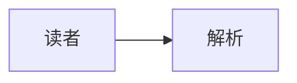
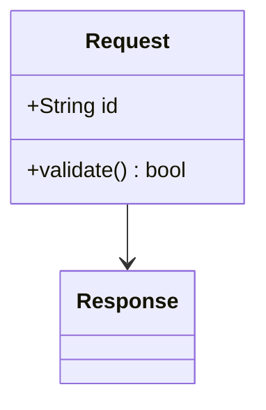
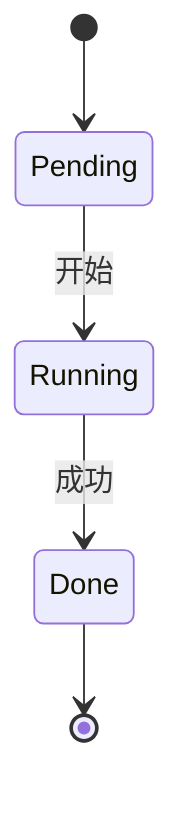
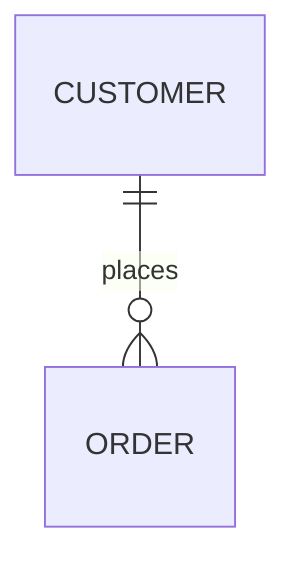
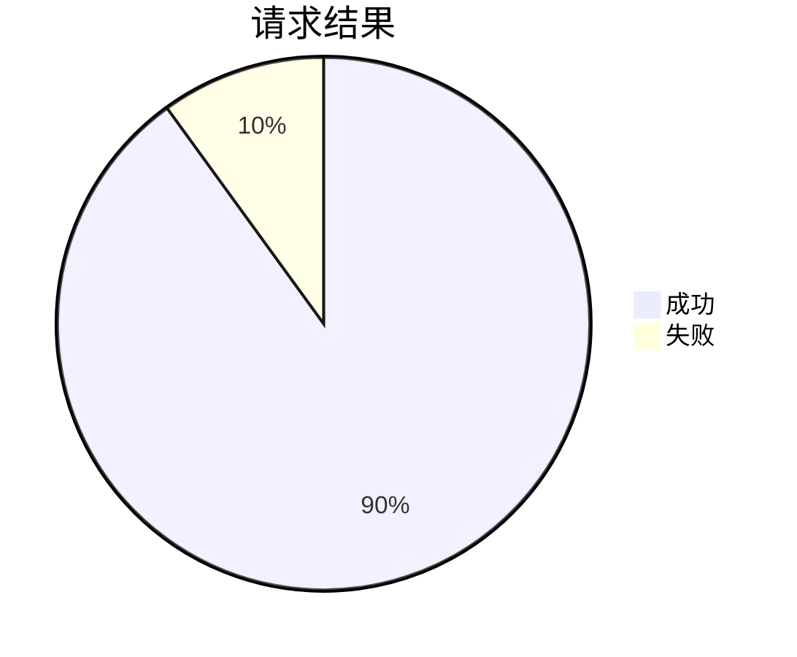

# Mermaid 示例

正文在代码块外。


```mermaid
%% 中文标签
flowchart LR
    Reader["读者"] --> Parser[解析]
```

~~~mermaid
sequenceDiagram
    Alice->>Bob: 你好
~~~

> 引用中的图：
>
> ```mermaid
> flowchart TD
>     Quoted --> Nested[嵌套]
> ```


```mermaid
classDiagram
    class Request {
        +String id
        +validate() bool
    }
    Request --> Response
```


```mermaid
stateDiagram-v2
    [*] --> Pending
    Pending --> Running: 开始
    Running --> Done: 成功
    Done --> [*]
```


```mermaid
erDiagram
    CUSTOMER ||--o{ ORDER : places
```


```mermaid
pie title 请求结果
    "成功" : 90
    "失败" : 10
```

代码块后的正文。
